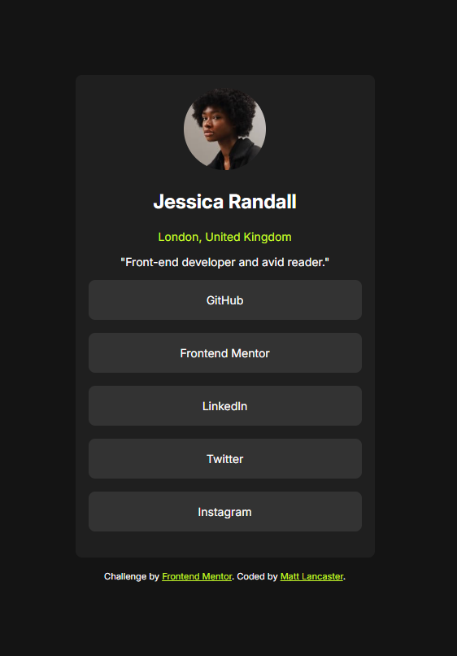

# Frontend Mentor - Social links profile solution

This is a solution to the [Social links profile challenge on Frontend Mentor](https://www.frontendmentor.io/challenges/social-links-profile-UG32l9m6dQ). Frontend Mentor challenges help you improve your coding skills by building realistic projects. 

## Table of contents

- [Overview](#overview)
  - [The challenge](#the-challenge)
  - [Screenshot](#screenshot)
  - [Links](#links)
- [My process](#my-process)
  - [Built with](#built-with)
  - [Continued development](#continued-development)
- [Author](#author)

## Overview

### The challenge

Users should be able to:

- See hover and focus states for all interactive elements on the page

### Screenshot

### Links

- Solution URL: [https://github.com/lank81/SocialProfileLinks]
- Live Site URL: [https://lank81.github.io/SocialProfileLinks/]

## My process

### Built with

- Semantic HTML5 markup
- CSS custom properties
- Flexbox
- Mobile-first workflow

### Continued development

The continual addition of small increments of learning has really made this fun, useful, and expedited my learning.  Having to create different shapes (circle image) and different but similar layouts has really helped with my confidence as I continue to learn front development.

## Author

- Frontend Mentor - [@lank81](https://www.frontendmentor.io/profile/lank81)
